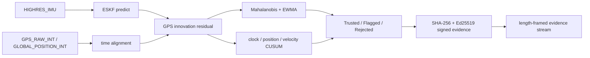

# RTVLAS-Slim

RTVLAS-Slim is a Rust prototype for GPS spoofing detection in small-UAS telemetry. It operates downstream of the GPS receiver on processed MAVLink navigation messages, compares GPS-reported motion against an IMU-propagated state estimate, and emits `Trusted`, `Flagged`, or `Rejected` verdicts with signed evidence records.

GPS spoofing matters because small autonomous aircraft often trust processed GPS position and velocity even when an attacker is manipulating the navigation solution. RTVLAS-Slim fills a specific software-layer gap: it can be added to a PX4-style MAVLink telemetry path without replacing the GPS receiver, accessing raw intermediate-frequency samples, or modifying RF hardware.

> Current scope: this is a simulator and processed-dataset prototype. It is not field validated, not RF-layer detection, not a hardware-qualified flight system, and not a claim of generalized platform robustness.

## Key Results

### Processed TEXBAT Replay

Command:

```powershell
cargo run --example run_texbat_harness
```

Measured on `2026-05-13` using processed TEXBAT `navsol.mat` artifacts under `artifacts/texbat`:

| Scenario | Attack shape represented here | Trusted / Flagged / Rejected | Anomaly TPR | Anomaly FPR | Rejected TPR | Rejected FPR |
| --- | --- | ---: | ---: | ---: | ---: | ---: |
| `cleanStatic-baseline` | clean static receiver | `2115 / 0 / 0` | n/a | `0.000` | n/a | `0.000` |
| `ds2` | abrupt carry-off | `566 / 13 / 1521` | `0.978` | `0.034` | `0.975` | `0.020` |
| `ds3` | gradual low-magnitude drift | `651 / 4 / 1441` | `0.953` | `0.032` | `0.953` | `0.025` |
| `ds7` | subtle time-push / phase-aligned case | `567 / 0 / 1608` | `0.999` | `0.000` | `0.999` | `0.000` |

These are processed navigation-solution replays, not raw RF or raw IF receiver tests. See [docs/THREAT_MODEL.md](docs/THREAT_MODEL.md) for the architectural boundary.

### PX4 SIH Multi-Mission Nominal FPR

Command:

```bash
bash scripts/wsl_px4_multi_mission_benchmark.sh 120
```

Measured on `2026-05-13` using PX4 Software-In-The-Loop with SIH dynamics:

| Mission | Nominal verdicts | Nominal anomaly FPR | Nominal rejected FPR | Standard injected-spoof anomaly / rejected TPR | Zero-rejection sweep cases |
| --- | ---: | ---: | ---: | ---: | ---: |
| `hover` | `120 / 0 / 0` | `0.000` | `0.000` | `0.951 / 0.676` | `47 / 144` |
| `forward` | `120 / 0 / 0` | `0.000` | `0.000` | `0.660 / 0.540` | `53 / 144` |
| `turn` | `120 / 0 / 0` | `0.000` | `0.000` | `0.802 / 0.475` | `46 / 144` |
| `climb` | `120 / 0 / 0` | `0.000` | `0.000` | `0.554 / 0.455` | `50 / 144` |

The previous turn-regime false-positive blocker was `0.717` anomaly FPR. The current measured SIH result is `0.000`, against an acceptance target of below `0.10`. This fix should not be generalized to hardware or high-dynamics flight until those paths are tested.

### Baseline Comparison

Command:

```powershell
cargo run --example run_texbat_baselines
```

Measured with a `5.0 m` naive distance threshold and a `3.0 sigma` innovation baseline:

| Scenario | RTVLAS full TPR/FPR | Naive distance TPR/FPR | Innovation `N_sigma` TPR/FPR |
| --- | ---: | ---: | ---: |
| `cleanStatic` | `0.000 / 0.000` | `0.000 / 0.000` | `0.000 / 0.000` |
| `ds2` | `0.978 / 0.034` | `0.445 / 0.102` | `0.000 / 0.018` |
| `ds3` | `0.953 / 0.032` | `0.631 / 0.125` | `0.000 / 0.025` |
| `ds7` | `0.999 / 0.000` | `0.000 / 0.000` | `0.000 / 0.000` |

The baseline result is the main evidence that the sequential detection logic is doing real work beyond a single residual threshold. See [docs/BASELINES.md](docs/BASELINES.md).

## Architecture

RTVLAS-Slim uses an IMU-driven ESKF prediction as the local physics reference, then evaluates GPS position and velocity claims against that reference. The detector combines Mahalanobis-normalized innovation scoring, EWMA risk accumulation, clock-bias persistence, horizontal position-residual CUSUM, velocity-residual CUSUM, and an opt-in flag-then-confirm state machine for live operator output.



The current evidence stream is length-framed and each packet is individually signed. A Merkle root or append-only Merkle accumulator is not implemented in the current source tree.

## Reproduce

Core Rust checks:

```powershell
cargo fmt --all --check
cargo check --no-default-features
cargo check --all-targets
cargo test --lib
```

Processed TEXBAT results:

```powershell
.\scripts\download_texbat_processed.ps1
cargo run --example run_texbat_harness
cargo run --example run_texbat_ablation
cargo run --example run_texbat_baselines
```

PX4 SIH replay and live-proxy paths:

```bash
bash scripts/wsl_px4_benchmark.sh 60
bash scripts/wsl_px4_multi_mission_benchmark.sh 120
bash scripts/wsl_px4_live_spoof.sh
bash scripts/wsl_px4_gradual_spoof.sh
```

Evidence verification:

```powershell
cargo run --example verify_evidence artifacts/wsl_px4_live_spoof_evidence.bin
```

Expected measured output for the current evidence artifact:

```text
Evidence file: artifacts/wsl_px4_live_spoof_evidence.bin
  packets verified: 30
  trusted verdicts: 13
  flagged/rejected verdicts: 17
  first timestamp (ns): 3796000000
  last timestamp (ns): 6700000000
```

For a step-by-step reproduction guide, see [docs/REPRODUCE.md](docs/REPRODUCE.md).

## Repository Map

| Path | Purpose |
| --- | --- |
| [src/ekf_core](src/ekf_core) | IMU propagation, ESKF state, covariance propagation |
| [src/statistical_monitor](src/statistical_monitor) | Mahalanobis scoring, EWMA, CUSUM persistence, trust verdicts |
| [src/telemetry_adapter](src/telemetry_adapter) | MAVLink ingestion, geodetic-to-NED conversion, GPS/IMU synchronization |
| [src/attestation](src/attestation) | evidence packet serialization, SHA-256 hashing, Ed25519 signing and verification |
| [src/benchmark](src/benchmark) | replay dataset runner and measurement summaries |
| [src/texbat_harness](src/texbat_harness) | processed TEXBAT replay harness and baselines |
| [examples](examples) | runnable benchmark, live, verification, and replay binaries |
| [scripts](scripts) | WSL2/PX4 helper scripts and dataset generation commands |
| [artifacts](artifacts) | measured datasets, sweep exports, logs, and evidence files |
| [docs/ALGORITHM.md](docs/ALGORITHM.md) | technical detector math and ablation interpretation |
| [docs/FORENSICS.md](docs/FORENSICS.md) | signed evidence format and verification chain |
| [docs/THREAT_MODEL.md](docs/THREAT_MODEL.md) | what the detector does and does not cover |
| [docs/BASELINES.md](docs/BASELINES.md) | baseline and ablation tables |
| [docs/REPRODUCE.md](docs/REPRODUCE.md) | full reproduction guide |
| [docs/benchmark-summary.md](docs/benchmark-summary.md) | compact measured-result record |
| [docs/verification.md](docs/verification.md) | additional verification notes |

## Known Limitations

- RTVLAS-Slim operates on processed navigation solutions, not raw RF or raw intermediate-frequency GPS samples.
- A receiver-level RF attack that remains internally consistent through the GPS receiver tracking loops is outside the current architecture.
- The repository does not contain paired TEXBAT IMU data, raw IF TEXBAT replay, outdoor receiver logs, hardware flight tests, or flight-controller deployment measurements.
- Current PX4 results are SIH simulator measurements over localhost/WSL2 paths.
- Current live-spoof results are software MAVLink man-in-the-middle tests, not RF spoofing tests.
- MAVLink compatibility is implemented around common PX4/ArduPilot-style messages, but the measured platform path is PX4 SIH.

## License

This repository is dual-licensed under MIT or Apache-2.0, at your option.

- [LICENSE-MIT](LICENSE-MIT)
- [LICENSE-APACHE](LICENSE-APACHE)
